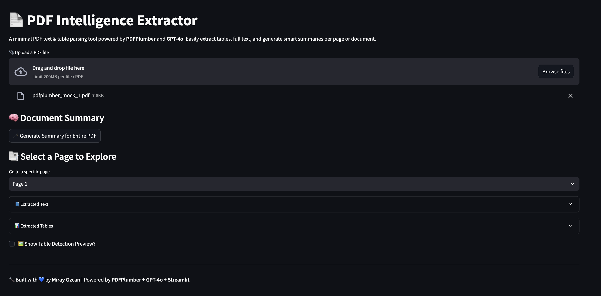
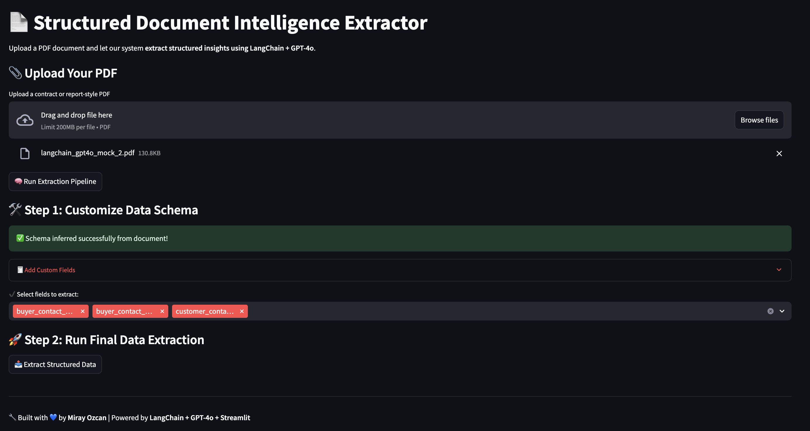
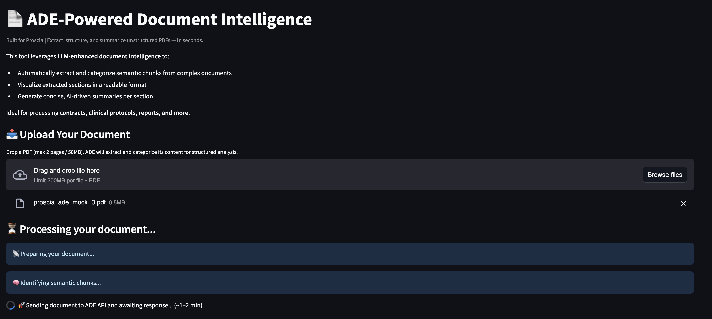

# 📄 Intelligent PDF Extractor Suite  
Built with 💙 by **Miray Ozcan** | Powered by **Streamlit + GPT-4o + LangChain + PDFPlumber**

> **Solve real internal bottlenecks with AI.**  
> This multi-version toolset tackles one of the biggest pain points faced by product operations and cross-functional teams: **valuable business data trapped inside messy PDFs** like contracts, onboarding forms, invoices, or configuration summaries.  

---

## 🔧 Motivation

During my internship interview at **Proscia**, I interviewed the Product Operations Lead and uncovered key internal pain points:

> ⚠️ _“The data often lives in PDFs we’ve signed with customers, but it’s never made it into a spreadsheet that’s queryable... It’s scattered, manual, inconsistent, or siloed. If we could automatically pull structured info from these documents and present it cleanly, we’d save hours per deal."_  

This repo aims to **automate that transformation pipeline** — turning unstructured PDFs into structured, queryable, and exportable datasets with just a few clicks.

---

## 🚦 App Versions Overview

| Version | Branch | Stack | Best For | Summary |
|--------|--------|-------|----------|---------|
| **v0** | `main` | `PDFPlumber + OpenAI` | ✅ Quick prototyping<br>✅ Lightweight extractions<br>✅ Page-by-page summaries | Extracts raw text and tables from PDFs using `pdfplumber`, then summarizes via GPT-4o. Ideal for simple forms or multi-page review. |
| **v1** | `v1`   | `Agentic Document Extraction (ADE)` | ✅ Formatted documents<br>✅ Contracts w/ visual structure<br>✅ Section-level summaries | Sends full PDFs to an external ADE API and groups semantic chunks into labeled sections. Excellent for internal PDF templates or procurement docs. |
| **v2** | `v2`   | `LangChain + GPT-4o` | ✅ Structured data schema<br>✅ Automating contract ingestion<br>✅ Extracting JSON records | Uses LangChain's document loader and schema detection to extract structured records with schema customization. Great for generating tabular insights from customer contracts. |

---

## 🧠 Feature Comparison

| Feature | v0 | v1 | v2 |
|--------|----|----|----|
| Extracts Tables | ✅ | ✅ | ❌ (focused on text records) |
| Extracts Raw Text | ✅ | ✅ | ✅ |
| Section-Based Summarization | 🚫 | ✅ | ✅ |
| Structured JSON Record Extraction | 🚫 | 🚫 | ✅ |
| Custom Schema Selection | 🚫 | 🚫 | ✅ |
| Full PDF Summarization | ✅ | ✅ | 🚫 |
| Export CSV | ✅ | ✅ | ✅ |
| Best For | Simpler docs | Long form or styled PDFs | Tabular contract data |

---

## ▶️ How to Run

> ⚙️ Each version lives in its own **branch**.

### Clone the repo:
```bash
git clone https://github.com/ozcanmiraay/opsbot.git
cd opsbot
```

### ⚙️ v0: PDFPlumber Text & Table Extractor
```bash
git checkout main
streamlit run app/streamlit_app.py
```

### 🤖 v1: Agentic Document Intelligence
```bash
git checkout v1
streamlit run ui/streamlit_app.py
```

### 🧠 v2: LangChain Schema-Based Extractor
```bash
git checkout v2
streamlit run app/streamlit_app.py
```

---

## 📸 Screenshots

| v0: Lightweight PDF Reader | v1: ADE-Powered Chunk Viewer | v2: LangChain Schema Extractor |
|----------------------------|-------------------------------|-------------------------------|
|  |  |  |

---

## 🧩 Real-World Use Cases at Proscia

- **Contract Intelligence**: Pulling features, pricing, infrastructure specs, and deployment configurations from customer contracts.
- **Sales Enablement**: Exporting client configuration from PDFs into CRM fields automatically.
- **Internal Alignment**: Creating dashboards where executives and department leaders view only the data relevant to them.
- **Audit Readiness**: Summarizing past signed forms and validating consistency across regions.

---

## 🛠️ Tech Stack

- **LLM**: GPT-4o via `langchain-openai`
- **Document Parsing**: `pdfplumber`, `PyPDFLoader`, Agentic Document Extractor by LandingAI
- **Interface**: Streamlit
- **Helpers**: LangChain prompt pipelines, recursive chunking, CSV export, HTML table rendering

---

## 🙌 Credits

Special thanks to the **Product Operations Lead at Proscia** for their insights and support in identifying real automation opportunities that can drive cross-team efficiency.
